项目结构：spring boot+maven

# 一、项目依赖审计

项目依赖没有发现已披露的漏洞

# 二、单点漏洞审计

## SQL：

根据依赖包我们可以发现项目使用的mybatis
所以我们在xml文件中搜索${

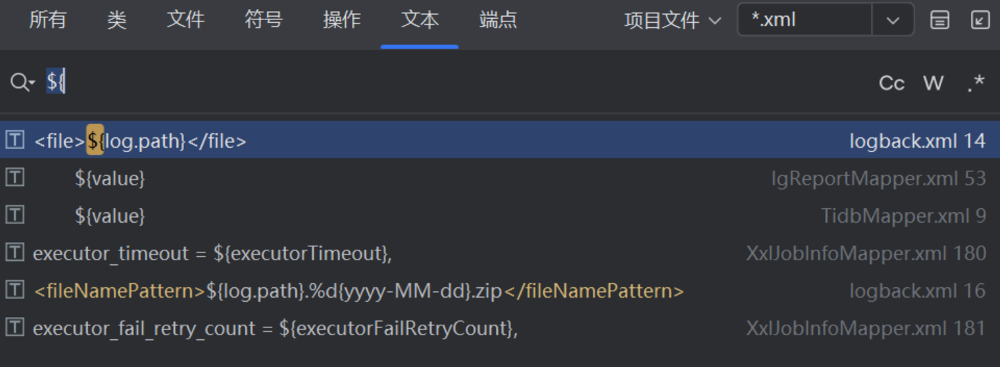

发现有这些地方使用了$，也就是可能存在SQL注入，我们一个一个看：

### 1、IgReportMapper.xml

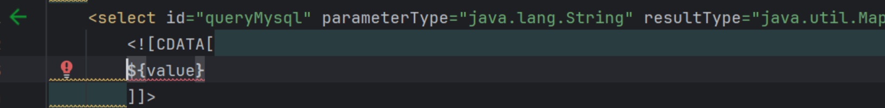

向上追溯：

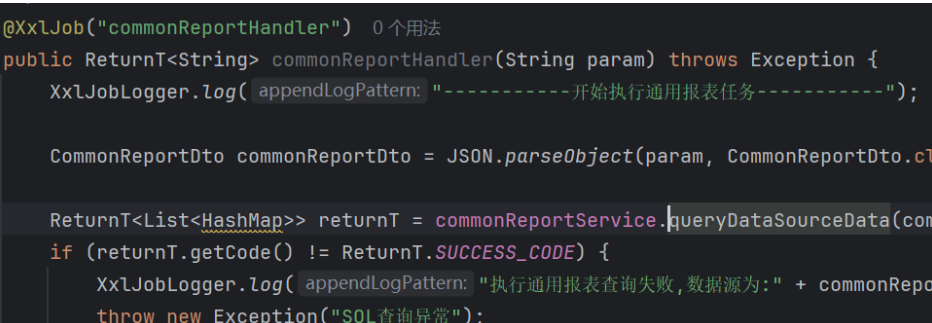

猜测这里是我的任务模块的功能实现
根据这些代码，我们还需要将数据源选择为MySQL
所以我们创建一个这样的任务：

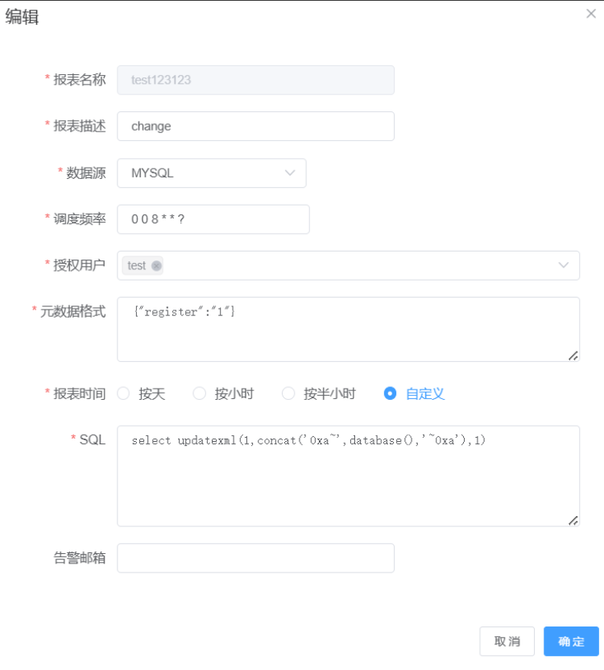

执行后查看日志：

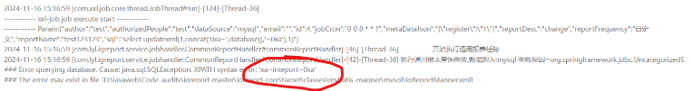

成功获取库名。

### 2、TidbMapper.xml

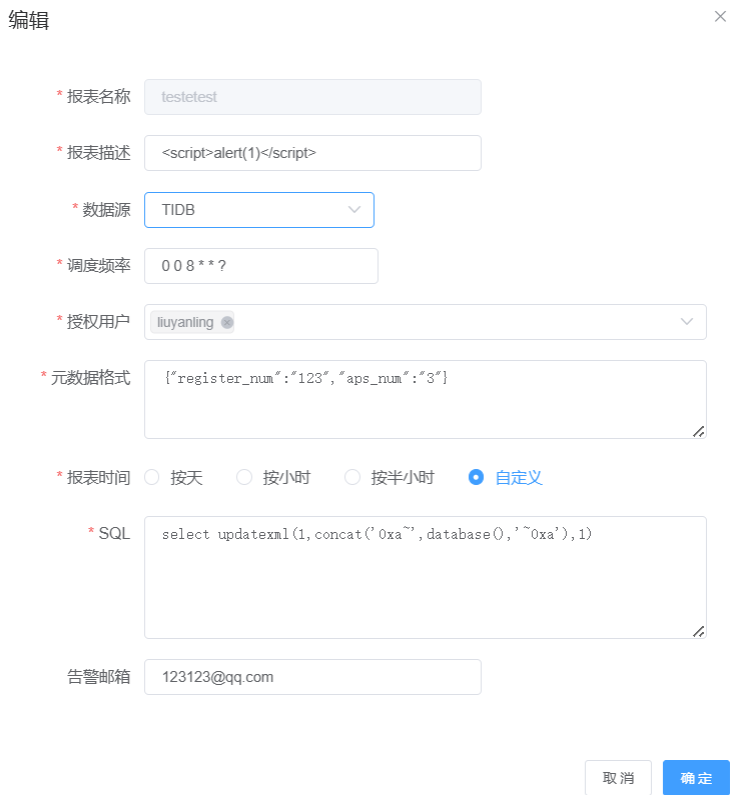

与上一个SQL业务逻辑相同，只是需要修改数据源：

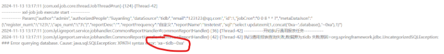

### 3、XxlJobInfoMapper.xml

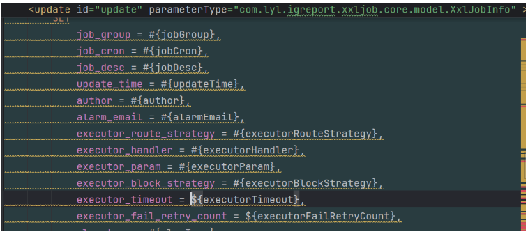

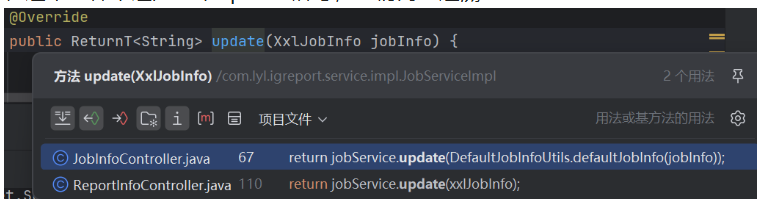

在这个文件中这是一个update语句，我们向上追溯：
这里没有对传参进行过滤或者修改，且有两个控制器调用了这个update语句，我们一个一个看：

### JobInfoController.java

这个控制器前端没找到调用的功能点，尝试拼接路由发现缺少描述，查看类的属性也没有描述的属性，所以判断这个控制器已经完全弃用。

### ReportInfoController.java

经过测试，发现两个注入点均为int类型，且未被使用，因此无法进行SQL注入
任意文件操作（上传、读取、写入）：
未找到任何有关文件操作的代码实现

## SSRF:

未找到任何远程HTTP请求的代码实现

## XXE:

未找到任何XML解析的代码实现

## URL跳转：

黑盒测试过程中未发现类似于URL的参数

## 模板注入：

分析依赖发现使用了Freemark作为模板引擎，但没有找到Freemark的模板

## SpEL注入：

没有找到任何SpEL的实现

# 三、前端渗透测试

## XSS注入：

1、在SQL注入中，我们发现日志中也存在XSS注入，于是我们创建一个如下的任务：

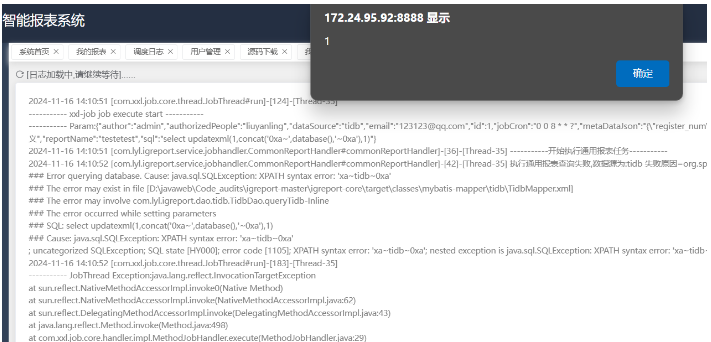

执行后查看日志：

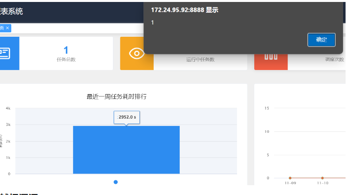

在首页中的最近任务耗时，当鼠标悬停于任务名字设置为XSSpayload的任务时，也会触发XSS

## 越权漏洞：

我们先创建一个test用户，登陆后，保存test用户的cookie，用于测试
1、我的任务功能存在垂直越权
在我的任务模块，使用admin用户创建一个任务，再使用test用户创建一个任务。

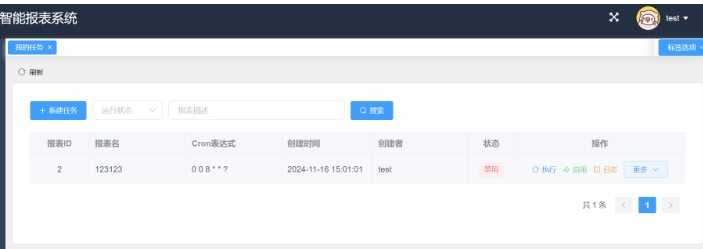

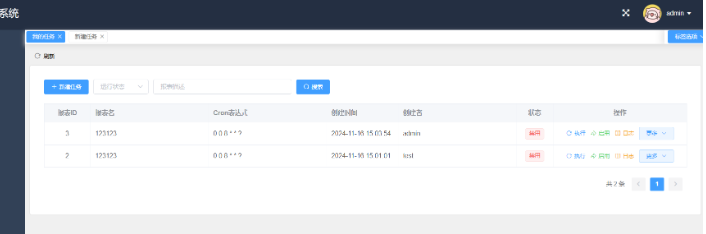

使用test用户点击删除自己的任务后抓包。

```html
POST /api/jobinfo/remove HTTP/1.1
Host: 172.24.95.92:8888
Content-Length: 8
Accept: application/json, text/plain, */*
User-Agent: Mozilla/5.0 (Windows NT 10.0; Win64; x64) AppleWebKit/537.36 (KHTML, like Gecko) Chrome/110.0.5481.178 Safari/537.36
Content-Type: application/json;charset=UTF-8
Origin: http://172.24.95.92:8888
Referer: http://172.24.95.92:8888/
Accept-Encoding: gzip, deflate
Accept-Language: zh-CN,zh;q=0.9
Cookie: XXL_JOB_LOGIN_IDENTITY=7b226964223a332c22757365726e616d65223a2274657374222c2270617373776f7264223a223039386636626364343632316433373363616465346538333236323762346636222c22726f6c65223a302c227065726d697373696f6e223a2231227d
Connection: close

{"id":2}
```

修改id为admin用户所创建任务的id，也就是3。发送数据包。

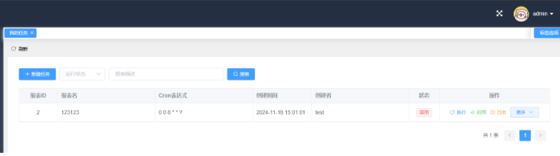

成功删除admin用户的任务，编辑功能同样存在越权漏洞，甚至可以直接将admin用户的任务变为自己的任务
至此，第一套报表系统源码审计结束。
